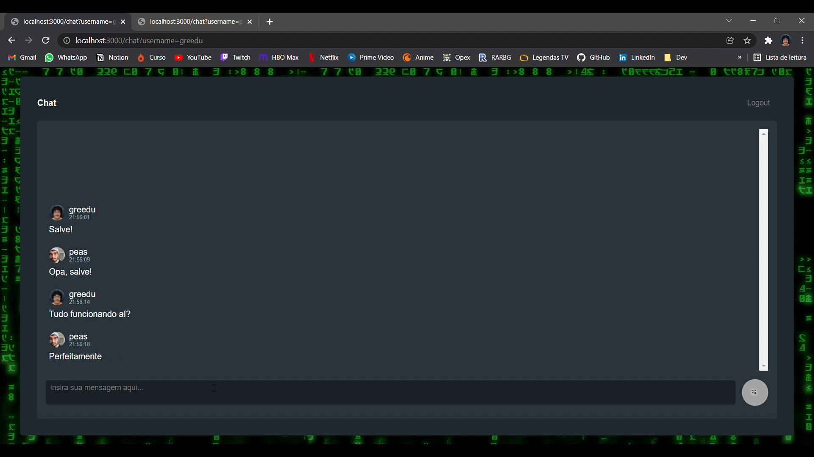

# Aluracord - Matrix
 
 

## Sobre
O projeto foi realizado durante a Imersão React Next.js promovido pela @alura e consiste num chat baseado no Slack e Discord.

O projeto serviu de grande aprendizado e base para paralelos como uso do hook `useRouter()` do Next.js, hooks `useEffect()` e `useState()` do React, uso do método `map()` no React, linhas de código declarativas, AJAX e realtime com o BaaS @Supabase, uso de componentes de terceiros, aqui fazendo uso do skynexui, biblioteca do próprio @omariosouto, e até mesmo um button com pop up para stickers.  

A aplicação tem soluções simples para funcionalidades que melhoram a experiência de qualquer usuário, deixando espaço para muitas melhorias que virão no futuro.

## Inicializando

Para inicializar: 
1. Primeiro deve ser criado um projeto no @Supabase que será responsável pelo back end e database da aplicação, dessa forma iremos obter a Anon Key e a URL necessárias para passarmos o método `createClient()` da biblioteca do @Supabase e fazermos a conexão. **As chaves encontradas neste repositório são apenas demonstrativas**
2. Feita a conexão com o BaaS, o script `npm run dev` fará a inicialização do projeto e o acesso será a partir do endereço http://localhost:3000

## Dependências

Os pacotes utilizados no projeto foram:
- @skynexui/components
- supabase/supabase-js
- next
- react-dom
- react

> O Next.js foi instalado manualmente, seguir o passo a passo disponibilizado em <https://nextjs.org/docs/getting-started>
